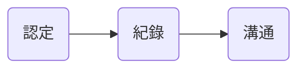

# 何謂會計？

>Accounting is the information system that identifies, records, and communicates the economic event of an organization to interested users.

白話文：會計資訊是用來紀錄企業買賣商品及服務的故事。

### 三項會計活動

### 何謂有效的資訊？

有效的資訊必須擁有兩個特性：

- Relevance（實用性）：財務資訊須具備影響決策的能力
- Faithful Representation（忠實表達）：財務資訊須與事實一致

### 會計的使用者

- 內部使用者
    - 公司的管理階層
    - 使用「管理會計」(managerial accounting)
- 外部使用者
    - 投資人、債權人、稅捐稽徵處、主管機關、客人、工會
    - 使用「財務會計」(financial accounting)

# 會計準則

>有效的財務報告仰賴正確且道德的行為。

### 兩大組織與兩大準則

|組織|準則|主要使用者|特色|
|:-:|:-:|:-:|:-:|
|IASB|IFRS|國際通用|只做原則性的「建議」 (principle-based)|
|FASB|GAAP|美國|詳細「規範」每一個細則 (rule-based)|

>[!Info]
>台灣本來有自己的 GAAP (ROC GAAP)，但自 2013 開始採用 IFRS。

### 資產價值的兩種衡量原則

###### Historical Cost Principle

- 資產的價值等於其「買入成本」
- 適用於 fixed assets（固定資產），如：不動產、廠房及設備 (Property, Plant and Equipment/PP&E)

###### Fair Value Principle

- Fair value 中文為「公允價值」
- 資產的價值等於其「被處分的價格」，「處分」包括交易、所有權移轉
- 適用於經常被交易的資產，如：證券

>[!Note]
>IFRS 允許對 PP&E 進行 revaluation（資產重估價），但 GAAP 不允許。

### IFRS 的對財務報表的基本假設

###### Monetary Unit Assumption

會計紀錄只包含可以用貨幣表達的資料。

- 優點：可以量化，就有比較的標準
- 缺點：有些東西難以量化，比如服務的品質、老闆及員工的健康狀況、道德水平

###### Economic Entity Assumption

個人與企業的活動要分開，即使個人是老闆也不例外。

###### Accrual Basis

會計資訊應在經濟活動／事件發生當下即認列，不是等實際收到錢才紀錄。

###### Going-Concern Assumption

假設企業會永久經營下去，所以：

- 資產可以持續使用至目的完成 → 須要「折舊」
- 負債可於到期時清償
- 不用「清算」公司價值

但當企業打算解散時，就應放棄此假設。

### 三種企業型態

###### Proprietorship（獨資）

業主對於債務有「無限清償責任」。

>[!Note]
>在法律上，企業與業主是同一個體，但在會計中，還是要遵守 [[#Economic Entity Assumption]]。

###### Partnership（合夥）

所有合夥人對於債務皆有無限清償責任。

###### Corporation（公司）

- 所有權被分割為若干份可移轉的股份
- 擁有股份的人稱為股東
- 股東對於債務僅有「有限清償責任」，清償上限為出資額

# 會計恆等式

$$
\large{\textnormal{Assets} = \textnormal{Liabilities} + \textnormal{Stock-Holders' Equity}}
$$

$$
\textnormal{Assets} = \textnormal{Liabilities} + \textnormal{Stock-Holders' Equity}
$$

# 參考資料

- <https://ifinbook.tabf.org.tw/File/EBook/381723/S0307/files/basic-html>
