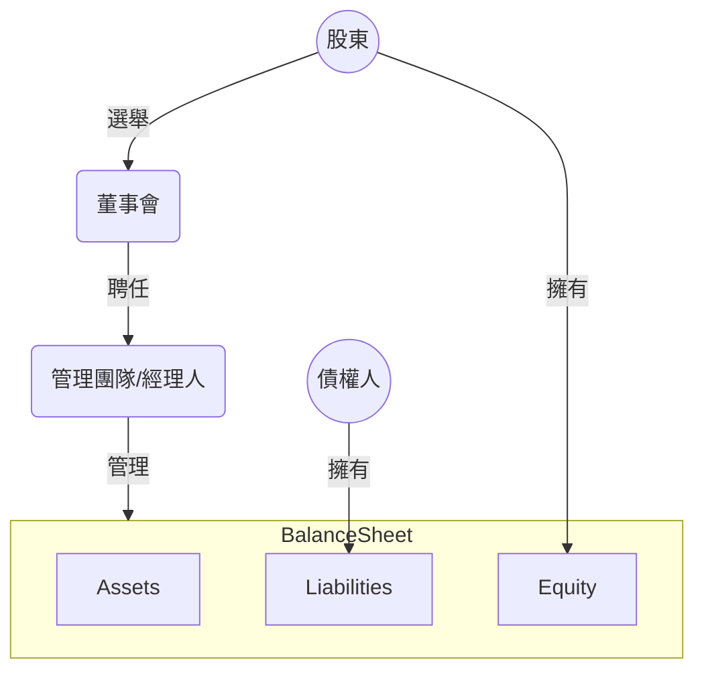
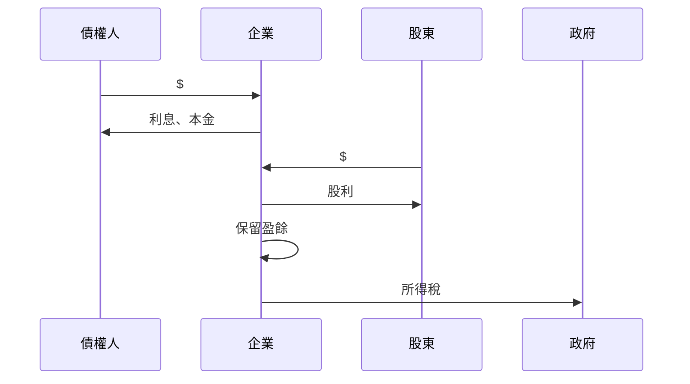

# 經營權與控制權分離

# 企業的目標

>企業的目標就是想辦法極大化自己長期的的市場價值 (market value)。

對於上市公司而言：

$$
市值 = 每股股價 \times 在外流通股數
$$

如果 [EMH](</經濟學原理/22 - Financial Economics.md#效率市場假說 (EMH)>) 為真，則其實經理人只要在對的時間做對的事情，就是在極大化企業長期的的市場價值。

>[!Note]
>經理人盲目地追求極大化營收 (sales revenue)、極大化[每股盈餘 (EPS)](</財務管理與投資/2 - 各種財務指標.md#EPS>)，或極大化市占率 (market share)，都不一定可以極大化企業長期的的市場價值，因為永遠有「犧牲長期利益換取短期利益」的做法（[詳見 Flavors of Fraud](</財務管理與投資/經典文章/Flavors of Fraud.md>)），而這些做法往往是對企業不好、甚至違法的。

# CFO 的任務

- 執行好的「投資策略」以提高[資產報酬率 (ROA)](</財務管理與投資/2 - 各種財務指標.md#ROA>)
- 執行好的「融資策略」$\rightarrow$  權衡資金成本與風險
- 妥善分配盈餘 $\rightarrow$ 決定要發股利或者保留盈餘進行再投資
- 妥善管理[營運資金 (WC)](</財務管理與投資/2 - 各種財務指標.md#Working Capital>)，維持一定的短期償債能力

# 資金成本 & 倒帳風險

- 獲得每一筆資金都會產生相應的成本，此即資金成本
- 公司的資金來源主要有「舉債」與「發行股票」兩種：
    - 「利息」是舉債的資金成本
    - 「股利」是發行股票的資金成本

### 舉債的資金成本比發行股票低

因為舉債有「==稅盾效應==」，舉債所產生的利息屬於費用，可以讓公司少繳一點所得稅，但股利不行。

###### 資金成本比較

普通股股票 > 非流動負債 > 流動負債

### 舉債有倒帳風險，但發行股票沒有

- 原因：利息一定要繳（會有償債壓力），但股利不一定要發
- 可以用 $L \over E$ （[財務槓桿](</財務管理與投資/2 - 各種財務指標.md#Financial Leverage>)）來衡量一間公司的倒帳風險

###### 倒帳風險比較

流動負債 > 非流動負債 > 0 = 普通股股票

# Principal-Agent Problem

若存在 [21 - Information Asymmetry](</經濟學原理/21 - Information Asymmetry.md>)，且經理人與股東的誘因結構不相容，則經理人就有可能因追求私利而做出不利股東的行為。

不過對於夠有名的企業來說，若經理人的經營績效不佳，會影響到他的名聲，所以通常經理人的行為不會偏離軌道太多。

### Agency Costs

股東可以透過「監督機制」與「綁定機制」來避免 principal-agent problem，而實行這兩個機制所產生的成本就是所謂的 agency costs（代理成本）。

其中綁定 (bonding) 機制包括：

- 提供經理人「認股」，使其成為股東
- 提供與股價連動的獎金制度

### 黃金降落傘

一間公司「被收購」時通常會有股本溢價，這對股東來說可能是好的，但一旦公司被收購，經理人通常就會因此失業，所以在參與是否出售公司的決策時（主要由董事會決定，但經理人可能也可以參與），經理人通常會反對。

而解決這個問題的其中一個方法，就是經理人與公司簽訂一個保障合約，在公司被收購後給予經理人一筆錢，並安排其調職或協助他找工作，這個保障合約就是所謂的「黃金降落傘」。

由於黃金降落傘也會成為併購成本的一部份，所以當補償金夠高時，某種程度上也可以避免被惡意併購。

# 資金的流向

企業的「稅前息前淨利」(earnings before interest & taxes, **EBIT**) 須依照下列順序分配：

1. 給債權人利息 $\rightarrow$ 剩下的是「稅前淨利」(earnings before taxes, **EBT**)
2. 繳稅給政府 $\rightarrow$ 剩下的是「淨利」(net income, **NI**)
3. 保留盈餘或發股利給股東

### 發股利 vs. 保留盈餘

###### 優先使用保留盈餘

企業欲擴張或者研發新產品時，若需要額外的資金，通常會優先使用保留盈餘 (retained earnings)，因為發行公司債與增資都等於是在昭告天下「我要開發新產品了」，而企業通常希望新產品的研發消息可以保密，尤其是在競爭激烈的產業中，最典型的例子就是 Apple。

###### 發股利對股東來說不一定是件好事

如果一間企業把所有賺的錢都發給股東，另一方面也就表示企業不打算在未來進行新的研發或擴張，這會讓進行中長期基本面投資的投資人對企業未來的「成長性」打上問號。

# 其它

- 即使是在同一個產業，大公司的財務績效也不一定會比小公司好，股價也不一定會比較高
- 銀行其實沒有那麼想借錢給還款能力太好的人，因為太快還錢的話銀行也沒什麼利息可收
    - 但如果是大企業的話，銀行通常還是很樂意借，因為與大企業打好關係以後可能會有好的合作機會
- 公司的資產負債表 (balance sheet) 上記載的 total assets 往往不等於公司的現在的市值，因為在會計中，資產的價格通常都是採用 historical cost 紀錄
