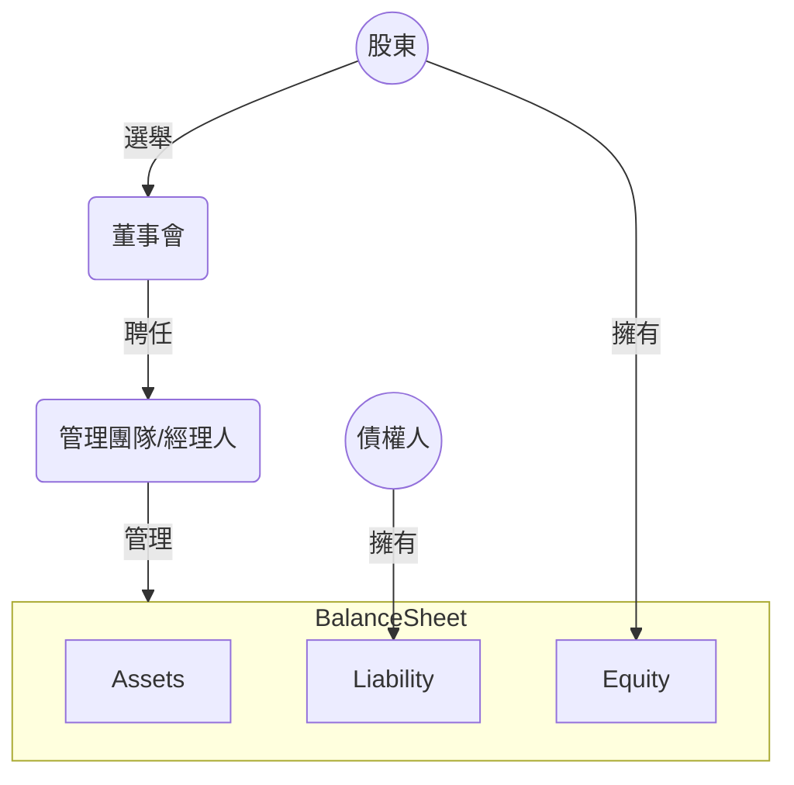

# 經營權與控制權分離

# 企業的目標

>企業的目標就是想辦法極大化自己長期的的市場價值 (market value)。

對於上市公司而言：

$$
市值 = 每股股價 \times 在外流通股數
$$

如果 [[財務經濟學導論#效率市場假說 (EMH)|EMH]] 為真，則其實經理人只要在對的時間做對的事情，就是在極大化企業長期的的市場價值。

>[!Note]
>經理人盲目地追求極大化營收 (sales revenue)、極大化[[各種財務指標#EPS|每股盈餘 (EPS)]]，或極大化市占率 (market share)，都不一定可以極大化企業長期的的市場價值，因為永遠有「犧牲長期利益換取短期利益」的做法（[[Flavors of Fraud|詳見 Flavors of Fraud]]），而這些做法往往是對企業不好、甚至違法的。

# CFO 的任務

- 執行好的「投資策略」以提高[[各種財務指標#ROA|資產報酬率 (ROA)]]
- 執行好的「融資策略」 $\rightarrow$  權衡資金成本與風險
- 妥善分配盈餘 $\rightarrow$ 決定要發股利或者保留盈餘進行再投資
- 妥善管理營運資金以減少「短期」資金成本

### 資金成本

- 獲得每一筆資金都會產生相應的成本，此即資金成本
- 公司的資金來源主要有「發行公司債」與「發行股票」兩種：
    - 「利息」是舉債的資金成本
    - 「股利」是發行股票的資金成本
- 一般認為舉債的資金成本比發行股票低，因為利息屬於費用，可以讓公司少繳一點所得稅，但股利不行
- 一般認為舉債的風險比發行股票高，因為利息一定要繳，但股利不一定要發

### 財務槓桿

將資產負債表的 liability 除以 equity 就是所謂的財務槓桿 (financial leverage)，通常會用 financial leverage 來衡量一間公司的倒帳風險，一間公司的財務槓桿越高，